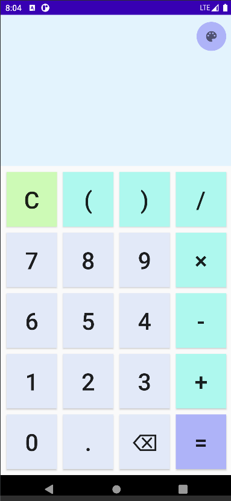
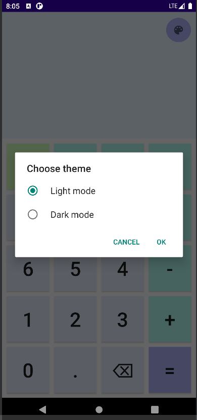
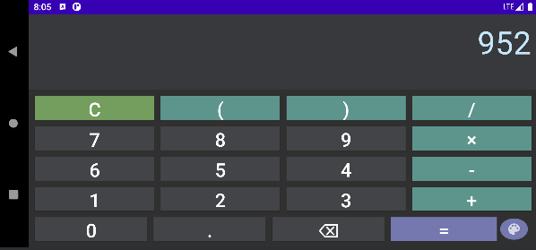

# Calculator
## Description
A simple calculator that performs 4 functions - addition, subtraction, multiplication and division. All calculation is done with RPN (Reverse Polish Notation)

---
## Preview

---
## Technologies that was used
- MVVM and LiveData
- Dagger2 (DI)
